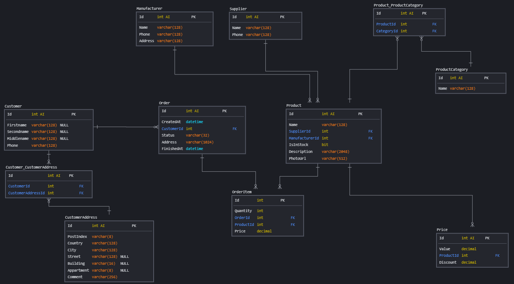

# Оглавление
* [Задача](#task)
* [Схема БД](#scheme)
* [Документация](#doc)
* [Примеры бизнес-задач](#usecases)
* [Рекомендации к использованию репликации](#replication)
* [Рекомендации к резервному копированию](#backup)

# Задача
> Реализуйте сущности продукты, категории продуктов, цены, поставщики, производители, покупатели и покупки.
> Свои решения для этой схемы приветствуются.
> 
> В проекте должны быть:
> * схема
> * документация
> * примеры бизнес-задач которые решает база
> * рекомендации к использованию репликации
> * рекомендации к резервному копированию (ДЗ автоматически засчитывается при защите проекта на последнем занятии модуля)

# Схема БД

# Документация
Особенности схемы:
1. Пока что не стал использовать более сложные типы для идентификаторов и ограничился int
2. Добавлена связующая таблица `Product_ProductCategory` для отображения связи many-to-many
3. Добавлена связующая таблица `Customer_CustomerAddress` для отображения связи many-to-many
4. Таблица `Price` является справочником, сама цена фиксируется на этапе оформления заказа в `OrderItem.Price`
5. Скидка хранится в таблице `Price`.
6. Наличие товара определяется в поле `Product.IsInStock`
7. При проектировании таблицы `CustomerAddress` учтены рекомендации из [статьи](https://habr.com/ru/company/hflabs/blog/260601/)
8. Ссылка на адрес в таблице `Order` отсутствует - это просто строковое поле, которое заполняется при формировании заказа.
9. Не стал добавлять в таблицу `Order` поле итоговой суммы заказа - оно будет рассчитываться каждый раз для отображения клиенту.

# Примеры бизнес-задач
1. Клиент имеет возможность посмотреть информацию по продуктам (категория, цена, фото, описание, производитель, скидка, наличие на складе)
2. Клиент имеет возможность сформировать заказ, посмотреть детальную информацию по нему (продукты, статус)
3. Клиент имеет возможность указать персональную информацию о себе, включая несколько адресов доставки
4. Цена фиксируется при формировании заказа и остается неизменной впоследствии

# Рекомендации к использованию репликации
Можно реализовать master-master репликацию и настроить автоинкрементные четные-нечетные идентификаторы для первичных ключей.

# Рекомендации к резервному копированию
TODO: реализовать позже