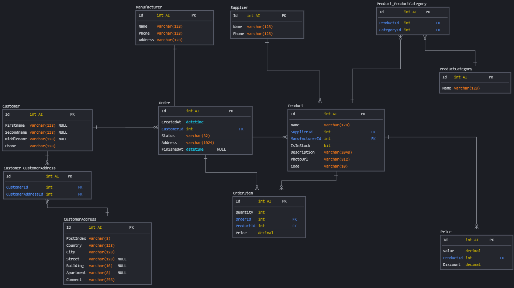

# Оглавление
* [Задача](#task)
* [Схема БД](#scheme)
* [Проводим анализ](#p1)
* [Предполагаем кардинальность](#p2)
* [Дополнительные индексы](#p3)
* [Логические ограничения](#p4)

# <a name="task"></a>Задача
> 1. Проводим анализ возможных запросов\отчетов\поиска данных.
> 2. Предполагаем возможную кардинальность поля.
> 3. Создаем дополнительные индексы - простые или композитные.
  На каждый индекс пишем краткое описание зачем он нужен (почему по этому полю\полям).
> 4. Думаем какие логические ограничения в БД нужно добавить - например какие поля должны быть уникальны, в какие нужно добавить условия, чтобы не нарушить бизнес логику. Пример - нельзя провести операцию по переводу средств на отрицательную сумму.
  Создаем ограничения по выбранным полям.

# <a name="scheme"></a>Схема БД


# <a name="p1"></a>Проводим анализ
## Возможные запросы

* Получение товаров (с ценами, категориями, прочей информацией), которые есть в наличии
```mysql
SELECT 
 product.Name, 
 product.Description, 
 product.PhotoUrl,
 price.Value,
 price.Discount,
 productCategory.Name,
 manufacturer.Name,
 supplier.Name
FROM `Product` AS product
INNER JOIN
 `Price` AS price ON product.Id = price.ProductId
LEFT JOIN
 `Product_ProductCategory` AS ppc ON product.Id = ppc.ProductId
LEFT JOIN
 `ProductCategory` AS productCategory ON productCategory.Id = ppc.CategoryId
INNER JOIN
 `Manufacturer` AS manufacturer ON manufacturer.Id = product.ManufacturerId
INNER JOIN
 `Supplier` AS supplier ON supplier.Id = product.SupplierId
WHERE IsInStock = True
```

* Получение списка товаров в выбранном заказе
```mysql
SELECT
 oi.Quantity,
 oi.Price
FROM
 `Order` AS o
INNER JOIN
 `OrderItem` AS oi ON oi.OrderId = o.Id
WHERE o.Id = 1
```

* Поиск клиентов по номеру телефона
```mysql
SELECT 
 Firstname,
 Secondname,
 Middlename,
 Phone
FROM `Customer`
WHERE Phone LIKE '+7%'
ORDER BY Secondname
```

* Подсчет количества заказов по клиентам

```mysql
SELECT
 CONCAT(customer.Secondname, ' ', customer.Firstname, ' ', customer.Middlename) AS 'Client',
 COUNT(*) AS 'Orders Count'
FROM `Customer` AS customer
INNER JOIN
 `Order` AS o ON o.CustomerId = customer.Id
GROUP BY o.CustomerId
```

* Поиск поставщиков по адресу
```mysql
SELECT
 m.Name,
 m.Phone,
 m.Address
FROM `Manufacturer` AS m
WHERE Address LIKE '%1%'
```

* Поиск клиентов по адресу

```mysql
SELECT
 CONCAT(customer.Secondname, ' ', customer.Firstname, ' ', customer.Middlename) AS 'Client',
 address.Country,
 address.City,
 address.Street,
 address.Building,
 address.Apartment
FROM `Customer` AS customer
INNER JOIN
 `Customer_CustomerAddress` AS ca ON customer.Id = ca.CustomerId
INNER JOIN
 `CustomerAddress` AS address ON address.Id = ca.CustomerAddressId
WHERE
 LOWER(CONCAT(address.Country, address.City, address.Street)) LIKE LOWER('%street%')
```

## Возможные отчеты
* Суммы заказов с группировкой по клиентам за указанный период времени
* Активные поставщики за указанный период времени
* Динамика цен на продукты за указанный период времени
* Динамика наличия товаров
* Динамика покупок
* Данные для визуализация расположения клиентов на карте (для анализа и последующего улучшения системы доставки заказов)

# <a name="p2"></a>Предполагаем кардинальность

| Таблица           | Поле            | Кардинальность |
| :---------------- | :-------------- | :------------: |
| `Price`           | Value           | High           |
|                   | Discount        | Medium         |
| `Supplier`        | Name            | High           |
|                   | Phone           | High           |
| `Manufacturer`    | Name            | High           |
|                   | Phone           | High           |
|                   | Address         | High           |
| `ProductCategory` | Name            | High           |
| `Customer`        | Firstname       | Medium         |
|                   | Secondname      | High           |
|                   | Middlename      | Medium         |
|                   | Phone           | High           |
| `CustomerAddress` | PostIndex       | High           |
|                   | Country         | Low            |
|                   | City            | Medium         |
|                   | Street          | High           |
|                   | Building        | High           |
|                   | Apartment       | High           |
|                   | Comment         | Medium         |
| `Product`         | Name            | High           |
|                   | IsInStock       | Low            |
|                   | Description     | High           |
|                   | PhotoUrl        | High           |
| `Order`           | CreatedAt       | High           |
|                   | FinishedAt      | High           |
|                   | Status          | Low            |
|                   | Address         | High           |
| `OrderItem`       | Quantity        | High           |
|                   | Price           | High           |

# <a name="p3"></a>Дополнительные индексы
| Таблица           | Индекс                                   | Поля                                             | Причина создания                                                       | Запрос                                                                                 |
| :---------------- | :--------------------------------------- | :----------------------------------------------- | :--------------------------------------------------------------------- | :------------------------------------------------------------------------------------- |
| `Price`           | IDX_Price_ValueDiscount                  | Value, Discount                                  | Часто запрашивается как часть информации о продукте                    | CREATE INDEX `IDX_Price_ValueDiscount` ON Price(Value, Discount);                      |
| `Supplier`        | IDX_Supplier_Name                        | Name                                             | Часто запрашивается как часть информации о продукте                    | CREATE INDEX `IDX_Supplier_Name` ON Supplier(Name);                                    |
| `Manufacturer`    | IDX_Manufacturer_NameAddress             | Name, Address                                    | Поиск производителя по адресу                                          | CREATE INDEX `IDX_Manufacturer_NameAddress` ON Manufacturer(Name, Address);            |
| `ProductCategory` | IDX_ProductCategory_Name                 | Name                                             | Часто запрашивается как часть информации о продукте                    | CREATE INDEX `IDX_ProductCategory_Name` ON ProductCategory(Name);                      |
| `Customer`        | IDX_Customer_Phone                       | Phone                                            | Поиск клиента по номеру телефона                                       | CREATE INDEX `IDX_Customer_Phone` ON Customer(Phone);                                  |
|                   | IDX_Customer_Fio                         | Secondname, Firstname, Middlename                | Получение информации о клиенте / сортировка по фамилии                 | CREATE INDEX `IDX_Customer_Fio` ON Customer(Secondname, Firstname, Middlename);        |
| `CustomerAddress` | IDX_CustomerAddress_Address              | Country, City, Street                            | Поиск адреса по стране, городу и улице                                 | CREATE INDEX `IDX_CustomerAddress_Address` ON CustomerAddress(Country, City, Street);  |
| `Product`         | IDX_Product_NameDescription              | Name, Description                                | Получение часто используемой информации о продукте / поиск по имени    | CREATE INDEX `IDX_Product_Name` ON Product(Name, Description);                         |
|                   | IDX_Product_IsInStock                    | IsInStock                                        | Использование в конструкции WHERE при поиске продуктов в наличии       | CREATE INDEX `IDX_Product_IsInStock` ON Product(IsInStock);                            |
| `Order`           | IDX_Order_CreatedAt                      | CreatedAt                                        | Для сортировки по дате создания заказа                                 | CREATE INDEX `IDX_Order_CreatedAt` ON Order(CreatedAt);                                |
| `OrderItem`       | IDX_OrderItem_PriceQuantity              | Price, Quantity                                  | Для построения отчета                                                  | CREATE INDEX `IDX_OrderItem_PriceQuantity` ON OrderItem(Price, Quantity);              |

Возможно также добавление других индексов по полям, которые используются в запросах где они указаны в выражениях:
* WHERE (при сравнении)
* ORDER BY
* GROUP B 

И для уникальных значений с высокой кардинальностью.

# <a name="p4"></a>Логические ограничения

| Таблица           | Поле            | Логическое ограничение                                                        |
| :---------------- | :-------------- | :---------------------------------------------------------------------------: |
| `Price`           | Value           | Положительное с плавающей запятой                                             |
|                   | Discount        | Положительное с плавающей запятой                                             |
| `Supplier`        | Name            | Уникальное                                                                    |
|                   | Phone           | Уникальное + формат +7-xxx-xxx-xx-xx                                          |
| `Manufacturer`    | Name            | Уникальное                                                                    |
|                   | Phone           | Уникальное + формат +7-xxx-xxx-xx-xx                                          |
| `ProductCategory` | Name            | Уникальное                                                                    |
| `Customer`        | Phone           | Уникальное + формат +7-xxx-xxx-xx-xx                                          |
| `CustomerAddress` | PostIndex       | Формат индекса                                                                |
| `Product`         | Code            | Уникальное (код товара)                                                       |
| `Order`           | Address         | Уникальное                                                                    |
| `OrderItem`       | Quantity        | Положительное целое                                                           |
|                   | Price           | Положительное с плавающей запятой                                             |
