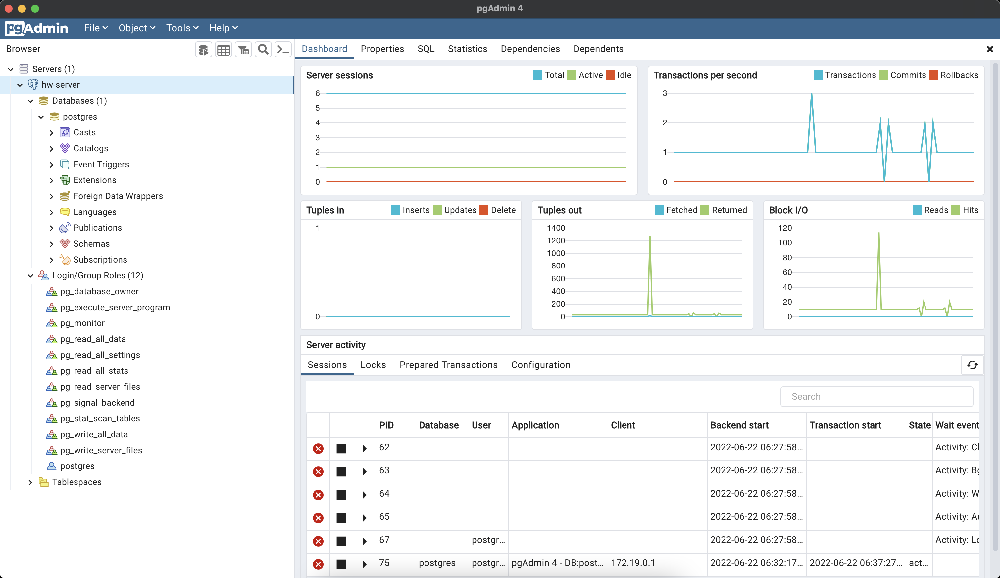

# Оглавление
* [Задача](#task)
* [Реализация](#impl)

# <a name="task"></a>Задача
> 1. Развернуть контейнер с PostgreSQL или установить СУБД на виртуальную машину.
> 2. Запустить сервер.
> 3. Создать клиента с подключением к базе данных postgres через командную строку.
> 4. Подключиться к серверу используя pgAdmin или другое аналогичное приложение.

# <a name="impl"></a>Реализация
## Добавляем файл compose.yaml
порт сменил на другой потому что локально есть еще
```
version: "2"
services:
  db:
    image: postgres:14
    restart: always
    environment:
      POSTGRES_PASSWORD: password
      PGDATA: /var/lib/postgresql/data/pgdata
    volumes:
      - ./data:/var/lib/postgresql/data
    ports:
      - "127.0.0.1:5433:5432"
```

## Запускаем контейнер командой
```shell
docker-compose -f compose.yaml up
```

## Добавляем сервер в pgAdmin, проверяем соединение

