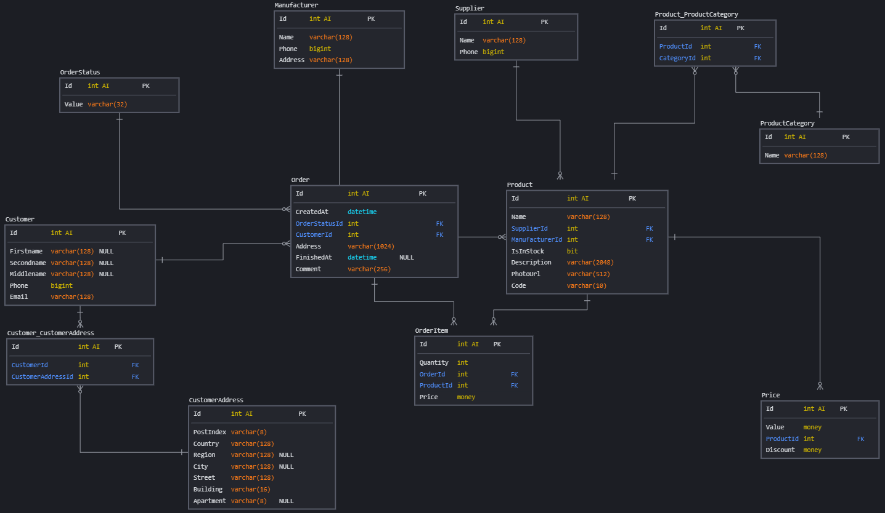

# Оглавление

* [Задача](#task)
* [Схема БД](#scheme)
* [Планирование](#plan)
* [Создаем БД](#p1)
* [Создаем схему данных](#p2)
* [Создаем табличные пространства и роли](#p3)
* [Создаем и распределяем таблицы](#p4)

# <a name="task"></a>Задача

> Реализовать спроектированную схему в postgres
> Используя операторы DDL создайте на примере схемы интернет-магазина:
> 1. Базу данных.
> 2. Табличные пространства и роли.
> 3. Схему данных.
> 4. Таблицы своего проекта, распределив их по схемам и табличным пространствам.

# <a name="scheme"></a>Схема БД



# <a name="plan"></a>Планирование

Представим вполне реальную ситуацию, когда необходимо реализовать следующие требования:

1. База данных будет иметь название `store` и использовать кодировку utf8
2. В рамках базы данных должны быть 2 схемы - `test` и `prod`
3. Таблицы схемы `prod` должны находиться на SSD диске
4. Пользователь `store_admin` должен иметь полные привилегии на всю базу
5. Пользователь `store_viewer` должен иметь привилегии только на чтение в схеме `prod`
6. Пользователь `store_dev` должен иметь полные привилегии в схеме `test`

# <a name="p1"></a>Создаем БД

```postgresql
DROP DATABASE IF EXISTS "store";

CREATE DATABASE "store"
    WITH OWNER "postgres"
    ENCODING "utf8"
    LC_COLLATE "en_US.utf8"
    LC_CTYPE "en_US.utf8";
```

# <a name="p2"></a>Создаем схему данных

Создаем схемы данных:

```postgresql
DROP SCHEMA IF EXISTS "test" CASCADE;
DROP SCHEMA IF EXISTS "prod" CASCADE;
CREATE SCHEMA "test";
CREATE SCHEMA "prod";
```

# <a name="p3"></a>Создаем табличные пространства и роли

Монтируем в систему SSD под табличное пространство и назначаем владельца:

```shell
root@c914ad139fd9:/# mkdir /ssd
root@c914ad139fd9:/# mount /dev/sdc1 /ssd
root@c914ad139fd9:/# chown -R postgres:postgres /ssd
```

Создаем табличное пространство:

```postgresql
CREATE TABLESPACE "store_prod"
    LOCATION '/ssd'
```

Вот так кстати можно задать БД новое табличное пространство (но по заданию это надо сделать для таблиц):

```postgresql
ALTER DATABASE "store"
    SET TABLESPACE "store_prod"
```

Создаем учетку администратора и назначаем полные привилегии:

```postgresql
CREATE USER "store_admin"
    WITH PASSWORD 'admin_super_secret_password';

GRANT ALL PRIVILEGES
    ON DATABASE "store"
    TO "store_admin";
```

Создаем учетку только для чтения в схеме `prod`:

```postgresql
CREATE USER "store_viewer"
    WITH PASSWORD 'viewer_password';

GRANT SELECT
    ON ALL TABLES
    IN SCHEMA "prod"
    TO "store_viewer";
```

Создаем учетку с правами в схеме `test`:

```postgresql
CREATE USER "store_dev"
    WITH PASSWORD 'dev_password';

GRANT ALL PRIVILEGES
    ON ALL TABLES
    IN SCHEMA "test"
    TO "store_dev";
```

# <a name="p4"></a>Создаем и распределяем таблицы

Для схемы `test` таблицы будут созданы при необходимости (сейчас не создаем).

Создаем таблицы в схеме `prod` и явно задаем им всем табличное пространство:

```postgresql
CREATE TABLE "prod"."OrderStatus"
(
    Id    INT GENERATED ALWAYS AS IDENTITY,
    Value VARCHAR(32) NOT NULL,
    PRIMARY KEY (Id)
) TABLESPACE "store_prod";

CREATE TABLE "prod"."Manufacturer"
(
    Id      INT GENERATED ALWAYS AS IDENTITY,
    Name    VARCHAR(128) NOT NULL,
    Phone   BIGINT       NOT NULL,
    Address VARCHAR(128) NOT NULL,
    PRIMARY KEY (Id)
) TABLESPACE "store_prod";

CREATE TABLE "prod"."Supplier"
(
    Id    INT GENERATED ALWAYS AS IDENTITY,
    Name  VARCHAR(128) NOT NULL,
    Phone BIGINT       NOT NULL,
    PRIMARY KEY (Id)
) TABLESPACE "store_prod";

CREATE TABLE "prod"."CustomerAddress"
(
    Id        INT GENERATED ALWAYS AS IDENTITY,
    PostIndex VARCHAR(8)   NOT NULL,
    Country   VARCHAR(128) NOT NULL,
    Region    VARCHAR(128),
    City      VARCHAR(128),
    Street    VARCHAR(128) NOT NULL,
    Building  VARCHAR(16)  NOT NULL,
    Apartment VARCHAR(8),
    PRIMARY KEY (Id)
) TABLESPACE "store_prod";

CREATE TABLE "prod"."ProductCategory"
(
    Id   INT GENERATED ALWAYS AS IDENTITY,
    Name VARCHAR(128) NOT NULL,
    PRIMARY KEY (Id)
) TABLESPACE "store_prod";

CREATE TABLE "prod"."Customer"
(
    Id         INT GENERATED ALWAYS AS IDENTITY,
    Firstname  VARCHAR(128),
    Secondname VARCHAR(128),
    Middlename VARCHAR(128),
    Phone      BIGINT       NOT NULL,
    Email      VARCHAR(128) NOT NULL,
    PRIMARY KEY (Id)
) TABLESPACE "store_prod";

CREATE TABLE "prod"."Customer_CustomerAddress"
(
    Id                INT GENERATED ALWAYS AS IDENTITY,
    CustomerId        INT NOT NULL,
    CustomerAddressId INT NOT NULL,
    PRIMARY KEY (Id),
    CONSTRAINT fk_customer FOREIGN KEY (CustomerId) REFERENCES "prod"."Customer" (Id),
    CONSTRAINT fk_customer_address FOREIGN KEY (CustomerAddressId) REFERENCES "prod"."CustomerAddress" (Id)
) TABLESPACE "store_prod";

CREATE TABLE "prod"."Product"
(
    Id             INT GENERATED ALWAYS AS IDENTITY,
    Name           VARCHAR(128)  NOT NULL,
    SupplierId     INT           NOT NULL,
    ManufacturerId INT           NOT NULL,
    IsInStock      BIT           NOT NULL,
    Description    VARCHAR(2048) NOT NULL,
    PhotoUrl       VARCHAR(512)  NOT NULL,
    Code           VARCHAR(10)   NOT NULL,
    PRIMARY KEY (Id),
    CONSTRAINT fk_supplier FOREIGN KEY (SupplierId) REFERENCES "prod"."Supplier" (Id),
    CONSTRAINT fk_manufacturer FOREIGN KEY (ManufacturerId) REFERENCES "prod"."Manufacturer" (Id)
) TABLESPACE "store_prod";

CREATE TABLE "prod"."Product_ProductCategory"
(
    Id         INT GENERATED ALWAYS AS IDENTITY,
    ProductId  INT NOT NULL,
    CategoryId INT NOT NULL,
    PRIMARY KEY (Id),
    CONSTRAINT fk_product FOREIGN KEY (ProductId) REFERENCES "prod"."Product" (Id),
    CONSTRAINT fk_product_category FOREIGN KEY (CategoryId) REFERENCES "prod"."ProductCategory" (Id)
) TABLESPACE "store_prod";

CREATE TABLE "prod"."Order"
(
    Id            INT GENERATED ALWAYS AS IDENTITY,
    CreatedAt     TIMESTAMP     NOT NULL,
    OrderStatusId INT           NOT NULL,
    CustomerId    INT           NOT NULL,
    Address       VARCHAR(1024) NOT NULL,
    FinishedAt    TIMESTAMP,
    Comment       VARCHAR(256),
    PRIMARY KEY (Id),
    CONSTRAINT fk_order_status FOREIGN KEY (OrderStatusId) REFERENCES "prod"."OrderStatus" (Id),
    CONSTRAINT fk_customer FOREIGN KEY (CustomerId) REFERENCES "prod"."Customer" (Id)
) TABLESPACE "store_prod";

CREATE TABLE "prod"."OrderItem"
(
    Id        INT GENERATED ALWAYS AS IDENTITY,
    Quantity  INT   NOT NULL,
    OrderId   INT   NOT NULL,
    ProductId INT   NOT NULL,
    Price     MONEY NOT NULL,
    PRIMARY KEY (Id),
    CONSTRAINT fk_order FOREIGN KEY (OrderId) REFERENCES "prod"."Order" (Id),
    CONSTRAINT fk_product FOREIGN KEY (ProductId) REFERENCES "prod"."Product" (Id)
) TABLESPACE "store_prod";

CREATE TABLE "prod"."Price"
(
    Id        INT GENERATED ALWAYS AS IDENTITY,
    Value     MONEY NOT NULL,
    ProductId INT   NOT NULL,
    Discount  MONEY NOT NULL,
    PRIMARY KEY (Id),
    CONSTRAINT fk_product FOREIGN KEY (ProductId) REFERENCES "prod"."Product" (Id)
) TABLESPACE "store_prod";
```

Проверяем директорию /ssd на наличие содержимого:

```shell
root@c914ad139fd9:/# tree /ssd
/ssd
└── PG_13_202007201
    └── 19146
        ├── 19891
        ├── 19898
        ├── 19905
        ├── 19912
        ├── 19915
        ├── 19917
        ├── 19922
        ├── 19929
        ├── 19932
        ├── 19934
        ├── 19939
        ├── 19956
        ├── 19959
        ├── 19961
        ├── 19976
        ├── 19993
        ├── 19996
        ├── 19998
        ├── 20013
        └── 20030

2 directories, 20 files
```
