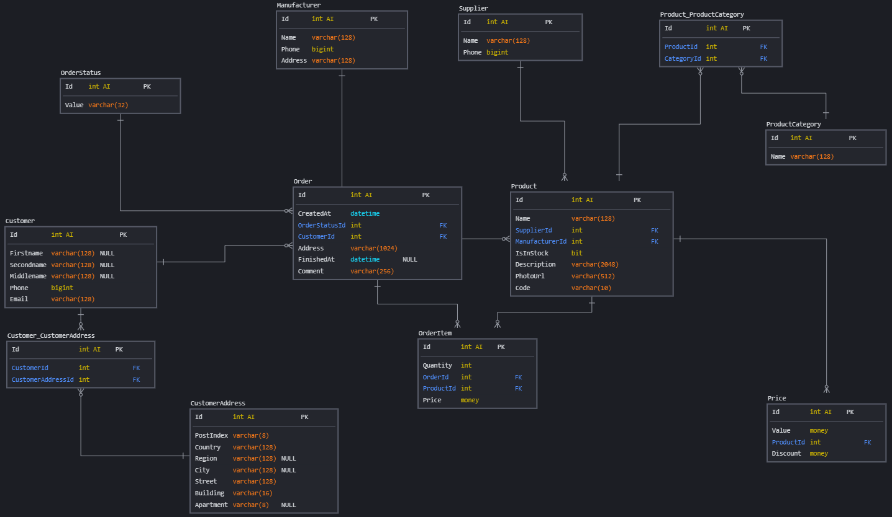

# Оглавление

* [Описание задач](#tasks)
* [Схема БД](#scheme)
* [Задача 1](#t1)
* [Задача 2](#t2)
* [Задача 3](#t3)
* [Задача 4](#t4)
* [Задача 5](#t5)
* [Задача 6](#t6)
* [Задача 7](#t7)

# <a name="tasks"></a>Описание задач

> 1. Создать индекс к какой-либо из таблиц вашей БД
> 2. Прислать текстом результат команды explain, в которой используется данный индекс
> 3. Реализовать индекс для полнотекстового поиска
> 4. Реализовать индекс на часть таблицы или индекс на поле с функцией
> 5. Создать индекс на несколько полей
> 6. Написать комментарии к каждому из индексов
> 7. Описать что и как делали и с какими проблемами столкнулись

# <a name="scheme"></a>Схема БД



# <a name="t1"></a>Задача 1

> Создать индекс к какой-либо из таблиц вашей БД

Создаем индекс по фамилии клиента:

```postgresql
CREATE INDEX idx_customer_secondname ON prod.customer (secondname);
```

# <a name="t2"></a>Задача 2

> Прислать текстом результат команды explain, в которой используется данный индекс

```postgresql
EXPLAIN
SELECT secondname
FROM prod.customer
ORDER BY secondname;
-- "Index Only Scan using idx_customer_secondname on customer  (cost=0.28..90.28 rows=2000 width=7)"
```

# <a name="t3"></a>Задача 3

> Реализовать индекс для полнотекстового поиска

Проверим без индекса:

```postgresql
EXPLAIN ANALYZE
SELECT description
FROM prod.product
WHERE to_tsvector('english', description) @@ to_tsquery('lorem | ipsum');
-- "Seq Scan on product  (cost=0.00..311.25 rows=5 width=176) (actual time=0.306..28.002 rows=196 loops=1)"
```

Создадим GIN-индекс:

```postgresql
CREATE INDEX idx_product_description_tsv ON prod.product USING GIN (to_tsvector('english', description));
```

Проверим с индексом:

```postgresql
EXPLAIN ANALYZE
SELECT description
FROM prod.product
WHERE to_tsvector('english', description) @@ to_tsquery('lorem | ipsum');
-- "Bitmap Heap Scan on product  (cost=12.29..30.33 rows=5 width=176) (actual time=0.058..0.138 rows=196 loops=1)"
```

# <a name="t4"></a>Задача 4

> Реализовать индекс на часть таблицы или индекс на поле с функцией

Получим только часть продуктов, что в наличии:

```postgresql
EXPLAIN ANALYZE
SELECT count(1)
FROM prod.product
WHERE isinstock = '1';
-- "Aggregate  (cost=61.91..61.92 rows=1 width=8) (actual time=0.548..0.550 rows=1 loops=1)"
```

Теперь создадим индекс по условию наличия продукта:

```postgresql
CREATE INDEX idx_product_isinstock ON prod.product (isinstock) WHERE isinstock = '1';
```

Проверим с индексом:

```postgresql
EXPLAIN ANALYZE
SELECT count(1)
FROM prod.product
WHERE isinstock = '1';
-- "Aggregate  (cost=12.75..12.76 rows=1 width=8) (actual time=0.215..0.217 rows=1 loops=1)"
```

# <a name="t5"></a>Задача 5

> Создать индекс на несколько полей

Создадим составной индекс по ФИО клиента:

```postgresql
CREATE INDEX idx_customer_fio ON prod.customer (secondname, firstname, middlename);
```

# <a name="t6"></a>Задача 6

> Написать комментарии к каждому из индексов

| Индекс                      | Описание                                             |
|:----------------------------|:-----------------------------------------------------|
| idx_customer_secondname     | Индекс по фамилии клиента                            |
| idx_product_description_tsv | Индекс для полнотекстового поиска по описанию товара |
| idx_product_isinstock       | Индекс по условию наличия продукта                   |
| idx_customer_fio            | Индекс по ФИО клиента                                |

```postgresql
COMMENT ON INDEX idx_customer_secondname IS 'Индекс по фамилии клиента';
COMMENT ON INDEX idx_product_description_tsv IS 'Индекс для полнотекстового поиска по описанию товара';
COMMENT ON INDEX idx_product_isinstock IS 'Индекс по условию наличия продукта';
COMMENT ON INDEX idx_customer_fio IS 'Индекс по ФИО клиента';
```

# <a name="t7"></a>Задача 7

> Описать что и как делали и с какими проблемами столкнулись

1. Необходимо было сгенерировать данные в БД, использовал сервис https://generatedata.com/generator. Полученные данные
   хранятся в директории generated.
2. В задаче №1 добавил сортировку по полю, чтобы индекс отработал - в противном случае не подхватывался.
3. В задаче №6 необходимо указать search_path: `SET search_path TO "$user", prod;`